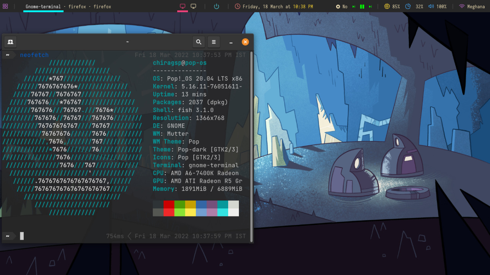

# PopOs_Rice
## first try to unix ricing #r/unixporn


Used
* Polybar
* FishShell

### FishShell
* fishshell (shell)
* ohmyfish (extension manager)
* bobthefish (theme)
* nerd font

### Install Polybar
```
sudo apt install polybar
```
Or
```
sudo apt-get install cmake cmake-data libcairo2-dev libxcb1-dev libxcb-ewmh-dev libxcb-icccm4-dev libxcb-image0-dev libxcb-randr0-dev libxcb-util0-dev libxcb-xkb-dev pkg-config python3-xcbgen xcb-proto libxcb-xrm-dev i3-wm libasound2-dev libmpdclient-dev libiw-dev libcurl4-openssl-dev libpulse-dev
sudo apt install libxcb-composite0-dev
sudo apt install libjsoncpp-dev
sudo ln -s /usr/include/jsoncpp/json/ /usr/include/json
git clone https://github.com/jaagr/polybar.git
cd polybar && ./build.sh
```
### playerctl
```
wget http://ftp.nl.debian.org/debian/pool/main/p/playerctl/libplayerctl2_2.0.1-1_amd64.deb
wget http://ftp.nl.debian.org/debian/pool/main/p/playerctl/playerctl_2.0.1-1_amd64.deb
sudo dpkg -i libplayerctl2_2.0.1-1_amd64.deb playerctl_2.0.1-1_amd64.deb
```
### zscroll
```
$ git clone https://github.com/noctuid/zscroll
$ cd zscroll
$ sudo python3 setup.py install
```

### rofi
```
sudo apt-get install rofi
```

### wmctrl
```
sudo apt install wmctrl
```
### Give Execution Permission
```
chmod +x ~/.config/polybar/scripts/*.sh
chmod +x ~/.config/polybar/scripts/*.sh
```

### To auto start put following line in ~/.profile
```
~/.conig/launch.sh
```

### To Run 
```
./.config/polybar/launch.sh
```
### To Stop
```
pkill polybar
```


### Credit:
[Reference 1](https://github.com/adi1090x/polybar-themes)

[Reference 2](https://github.com/raven2cz/polybar-config)

